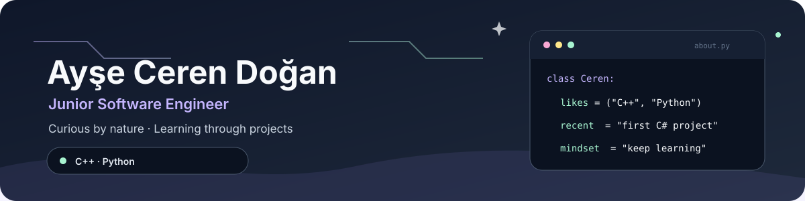

  

## ✦ A little about me

- Based in İstanbul, Türkiye
- Building web applications with **C#**, **.NET**, and **ASP.NET Core**
- Interested in backend architecture, testing, and reliable systems
- I care about software that is clear for both its users and its developers

## Tech I work with

  
  
  
  
  
  

## How I like to work

> Understand the problem → keep the design clear → build → test → improve.

I enjoy turning real-world workflows into practical software and learning how each part of a system works together.

  Thanks for stopping by ✦

